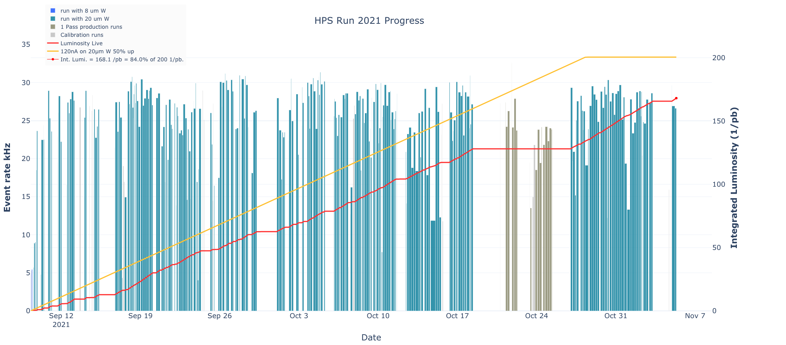
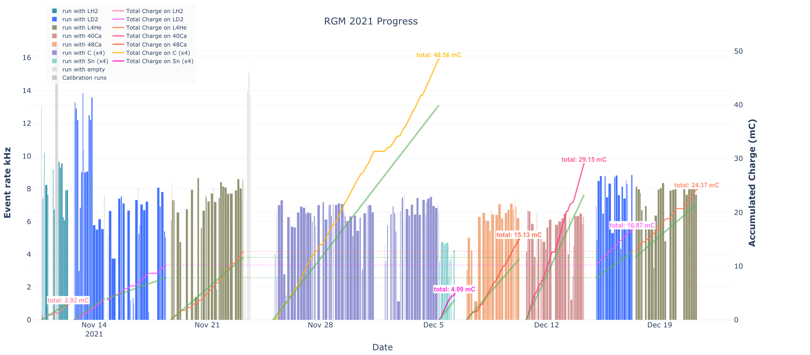

# RunData
Python Library to make it easier to query the Run Database (RCDB) and Mya for information. 

## Introduction

This package contains two useful classes: 
* RunData - Queries the RCDB database for useful information and fills a Pandas data-frame
 with the results. It uses the Mya class to retrieve additional information, such as 
 the charge for the run.
* Mya     - Uses the Web interface to the MYA database, which stores the slow controls 
 information. This class can be used as a stand alone or together with RunData
* HPSRun2019.py - An example program that uses these classes to retrieve data for the 
 HPS run of 2019 and create an Excel table and interactive plots of runs and accumulated
 charge.
 
 
## Important Notes: Cache

WARNING: In order to make the data retrieval manageable, the RunData class includes a caching feature
that will store the data locally. This very much speeds up the second time you run a program
that retrieves the same data, however, this cache is not yet super smart. It can detect
that a new run is now available and then add it, or that you are requesting a different 
time range. It **cannot** detect that on a second run you are asking for different Mya 
variables, or the contents of the RCDB changed. In such situations, just delete the
cache and re-run, or use the scripts with the cache disabled.

# Usage for Run Information Graphics

There are several scripts included here that show how to use this package to plot information about 
a run period. The scrips `HPSRun2021.py` and `HPSRun2019.py` show the run data information for two 
of the HPS runs, and `RGM2021.py` and `RGM2022.py` show the graphs for Run Group M. If you would like
add a script for a particular run group, please contact me.

